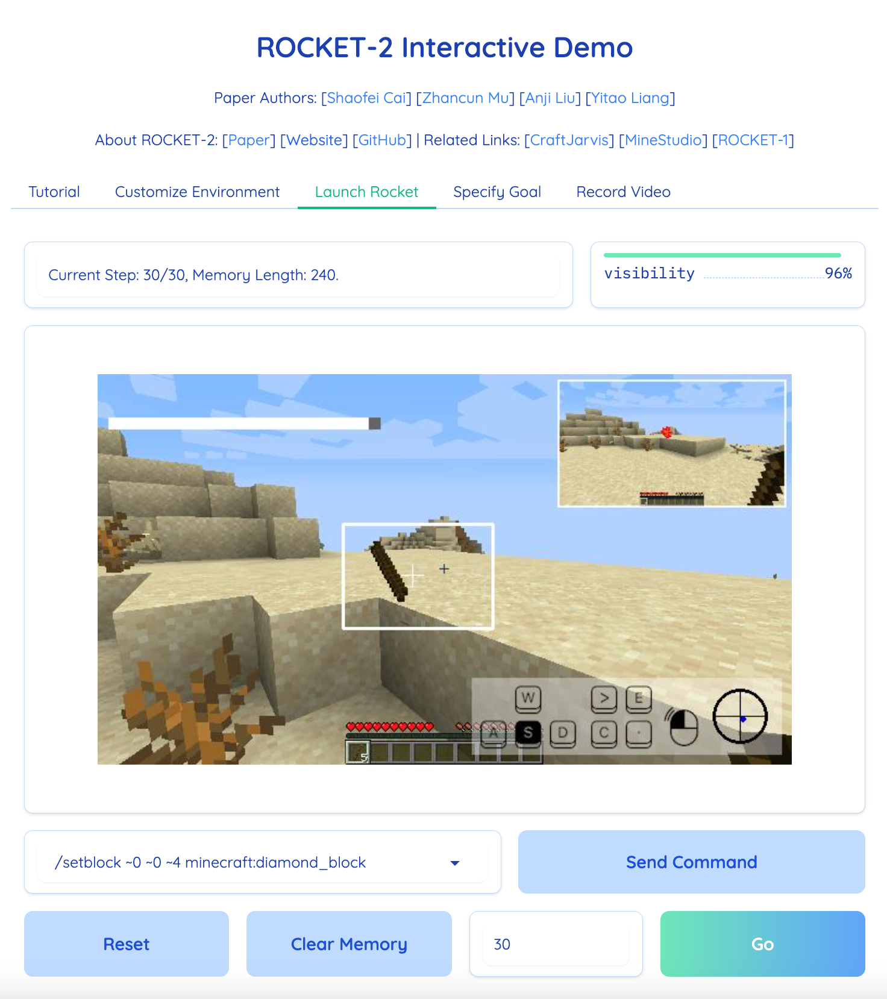

<!--
 * @Date: 2025-03-21 10:25:54
 * @LastEditors: caishaofei-mus1 1744260356@qq.com
 * @LastEditTime: 2025-03-21 10:32:18
 * @FilePath: /ROCKET2-OSS/README.md
-->
# ROCKET-2: Steering Visuomotor Policy via Cross-View Goal Alignment

[`Shaofei Cai`](https://phython96.github.io/) | [`Zhancun Mu`](https://zhancunmu.owlstown.net/) | [`Anji Liu`](https://liuanji.github.io/) | [`Yitao Liang`](https://scholar.google.com/citations?user=KVzR1XEAAAAJ&hl=zh-CN&oi=ao)

All authors are affiliated with Team **[`CraftJarvis`](https://craftjarvis.github.io/)**. 

[[`Project`](https://craftjarvis.github.io/ROCKET-2/)] | [[`Paper`](https://arxiv.org/abs/2503.02505)] | [[`huggingface`]()] | [[`Demo`](https://huggingface.co/spaces/phython96/ROCKET-2-DEMO)] | [[`BibTex`](#citig_rocket)] 


## Latest updates
- **03/21/2025 -- We have released the codebase for ROCKET-2!**

## Docker

```sh
docker built -t rocket2 .
docker run -it -p 7860:7860 --platform=linux/amd64 --gpus all rocket2:latest
```

## Gradio



## Citing ROCKET-2
If you use ROCKET-2 in your research, please use the following BibTeX entry. 

```
@article{cai2025rocket,
  title={ROCKET-2: Steering Visuomotor Policy via Cross-View Goal Alignment},
  author={Cai, Shaofei and Mu, Zhancun and Liu, Anji and Liang, Yitao},
  journal={arXiv preprint arXiv:2503.02505},
  year={2025}
}
```