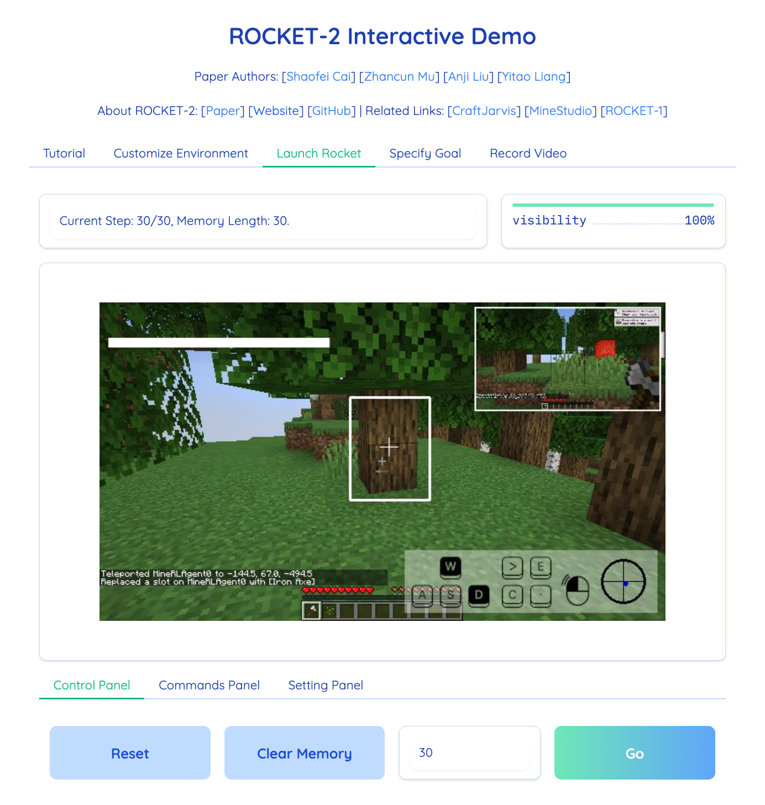

<!--
 * @Date: 2025-03-21 10:25:54
 * @LastEditors: caishaofei-mus1 1744260356@qq.com
 * @LastEditTime: 2025-03-21 10:32:18
 * @FilePath: /ROCKET2-OSS/README.md
-->
<h2 align="center"> ROCKET-2: Steering Visuomotor Policy via Cross-View Goal Alignment </h2>

<div align="center">

[`Shaofei Cai`](https://phython96.github.io/) | [`Zhancun Mu`](https://zhancunmu.owlstown.net/) | [`Anji Liu`](https://liuanji.github.io/) | [`Yitao Liang`](https://scholar.google.com/citations?user=KVzR1XEAAAAJ&hl=zh-CN&oi=ao)

All authors are affiliated with Team **[`CraftJarvis`](https://craftjarvis.github.io/)**. 

[](https://craftjarvis.github.io/ROCKET-2/)
[](https://arxiv.org/abs/2503.02505)
[](https://huggingface.co/papers/2503.02505)
[](#citig_rocket)
[](https://openbayes.com/console/public/tutorials/cHZ3teJXaQU)

<b> ROCKET-2 successfully inflicted damage on the Ender Dragon for the first time and spontaneously developed the ability to build bridges. (end-to-end training, directly control mouse & keyboard)</b>

<p align="center">
  
</p>

<b> ROCKET-2 was pre-trained only on Minecraft, yet generalizes zero-shot to other 3D games. </b>

<p align="center">
  
</p>
</div>

## Latest updates
- **03/21/2025 -- We have released the codebase for ROCKET-2!**

## Docker

```sh
docker build -t rocket2 .
docker run -it -p 7860:7860 --platform=linux/amd64 --gpus all rocket2:latest
```

## Gradio



## Citing ROCKET-2
If you use ROCKET-2 in your research, please use the following BibTeX entry. 

```
@article{cai2025rocket,
  title={ROCKET-2: Steering Visuomotor Policy via Cross-View Goal Alignment},
  author={Cai, Shaofei and Mu, Zhancun and Liu, Anji and Liang, Yitao},
  journal={arXiv preprint arXiv:2503.02505},
  year={2025}
}
```
